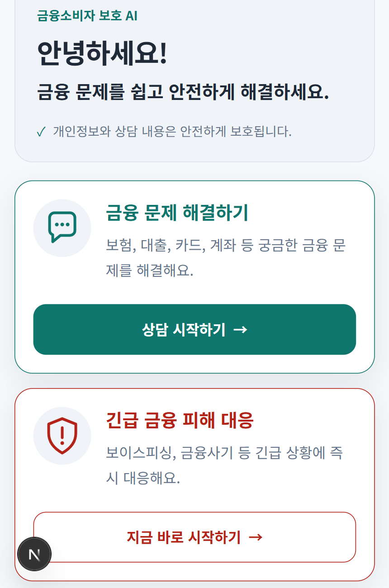
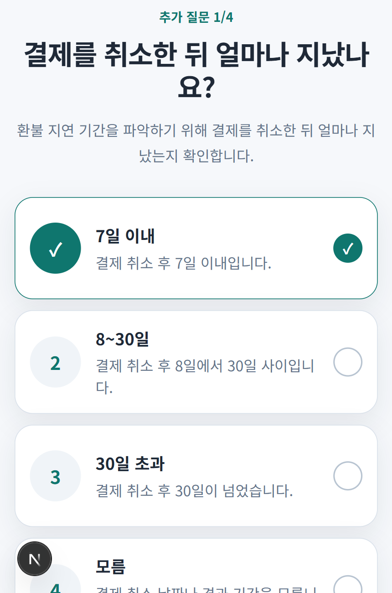
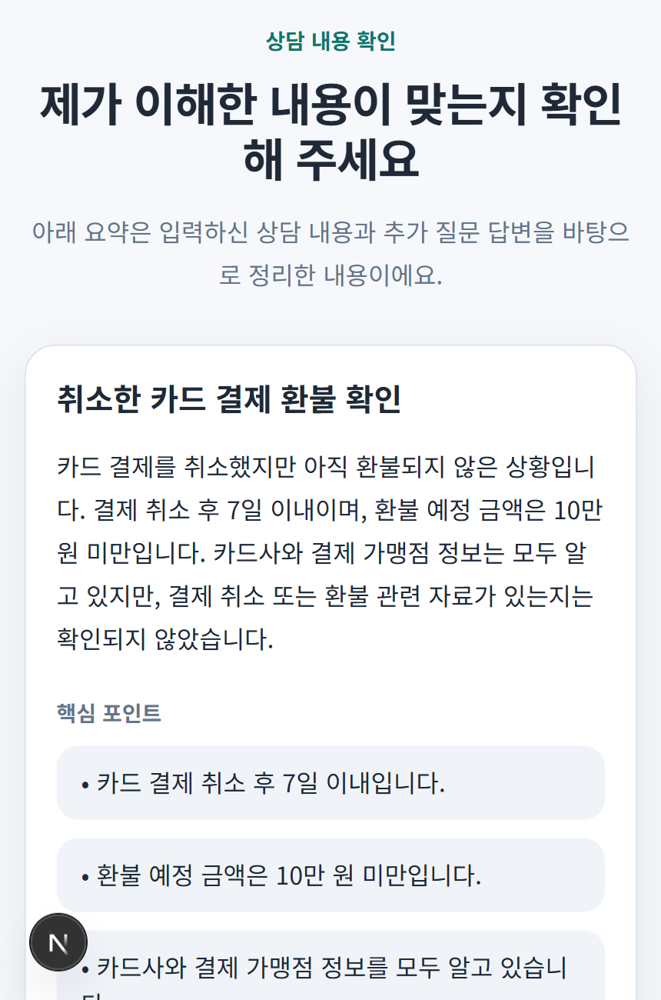
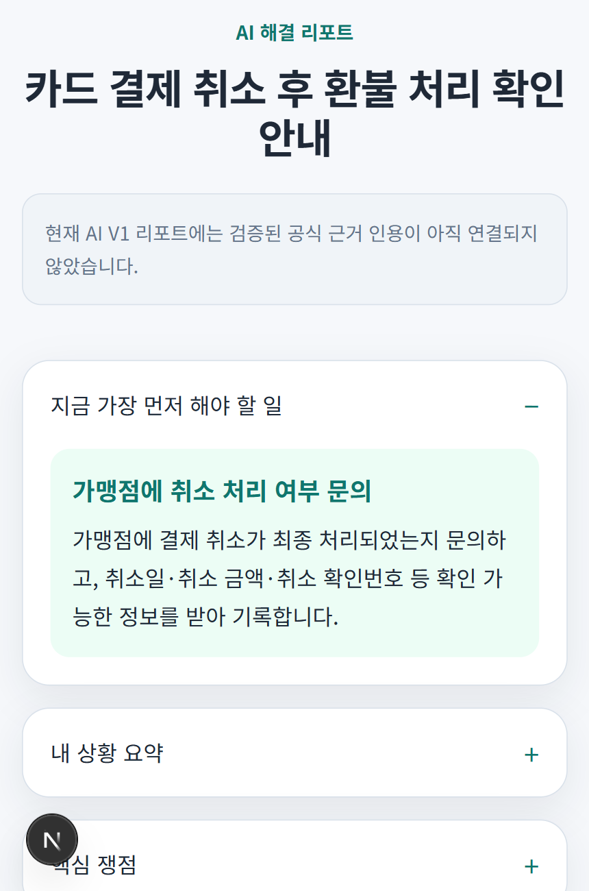
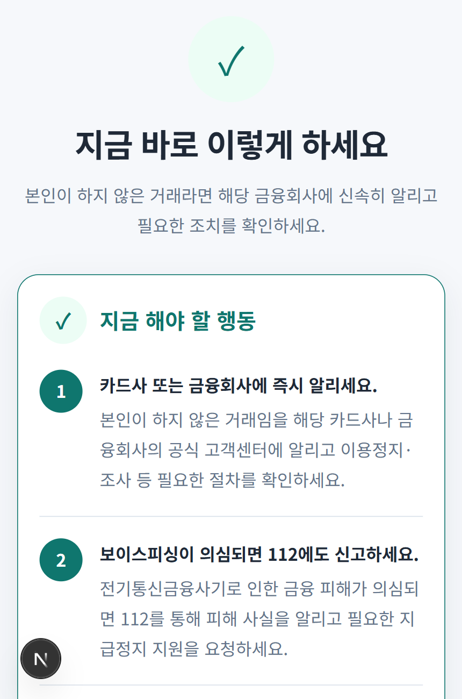
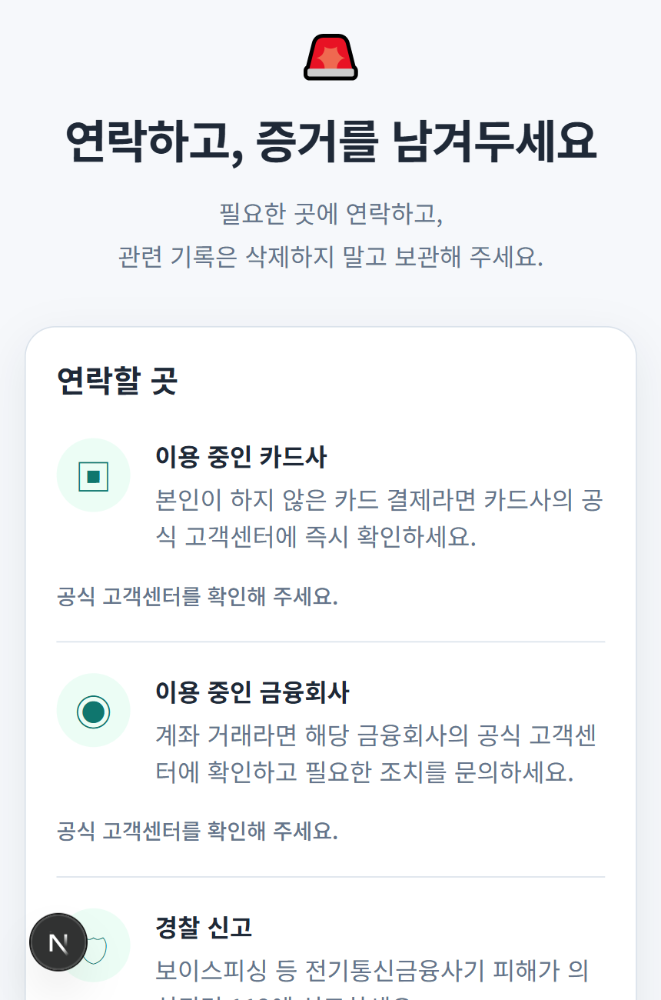

# 고령층 금융 도우미

50~70대 사용자가 금융 문제를 단계적으로 정리하고,
현재 상황과 다음 행동을 확인할 수 있도록 만든 금융소비자 보호 서비스입니다.

한 화면에서 여러 선택을 한꺼번에 요구하기보다,
가능하면 한 번에 하나의 판단에 집중할 수 있도록 화면 흐름을 구성했습니다.

> 현재 AI V1 상담 흐름과 긴급대응 MVP까지 구현했습니다.  
> 공식 금융자료 검색과 RAG, 근거 검증, 접근성 QA 및 배포는 다음 단계에서 진행합니다.

## Screens

<p align="center">
  
  
</p>

<p align="center">
  
  
</p>

## 상담 흐름

```text
문제 유형 선택
→ 상황 입력
→ AI 추가 질문
→ 상담 내용 요약 확인
→ 분석
→ 해결 리포트
```

사용자가 입력한 내용을 바로 분석 결과로 넘기지 않고,
추가 질문을 거친 뒤 AI가 이해한 내용을 사용자가 한 번 확인하도록 구성했습니다.

## 구현에서 중요하게 본 부분

### 상담 단계는 Backend를 기준으로 관리

상담 진행 단계는 Frontend가 따로 판단하지 않고
Backend의 `currentStep`을 기준으로 이동합니다.

새로고침하거나 상담 중간에 다시 접속하더라도
서버에 저장된 상태를 조회해 진행하던 단계로 돌아갈 수 있도록 했습니다.

상담 원문은 LocalStorage에 저장하지 않습니다.

### 상태의 역할 분리

```text
Server State         → TanStack Query
Form State           → React Hook Form + Zod
Local UI State       → useState
Consultation Flow    → Backend currentStep
```

서버에서 다시 확인해야 하는 데이터와
현재 화면에서만 필요한 상태를 구분해서 관리했습니다.

### 긴급 금융 피해 대응

긴급대응은 AI가 상황에 따라 내용을 새로 생성하지 않습니다.

사용자가 피해 유형을 선택하면
Backend에 저장된 `EmergencyScenario`를 조회해
즉시 행동, 하지 말아야 할 행동, 연락처와 증거 보존 방법을 보여줍니다.

## Emergency Flow

<p align="center">
  
  
</p>

## Tech Stack

`Next.js` `React` `TypeScript` `Tailwind CSS`  
`TanStack Query` `React Hook Form` `Zod`

## Run

```bash
npm ci
npm run dev
```

`.env.local`

```env
NEXT_PUBLIC_API_BASE_URL=http://localhost:8080/api/v1
```

## Links

- [Backend Repository](https://github.com/Economy0326/financial-helper-backend)
- [Project Documentation](https://cute-quit-4fd.notion.site/3bd25931ce3580ae8ad8f0fa3acdf41a)

## Next

다음 단계에서는 공식 금융자료를 검색하고
답변의 근거로 연결할 수 있도록 RAG를 추가할 예정입니다.