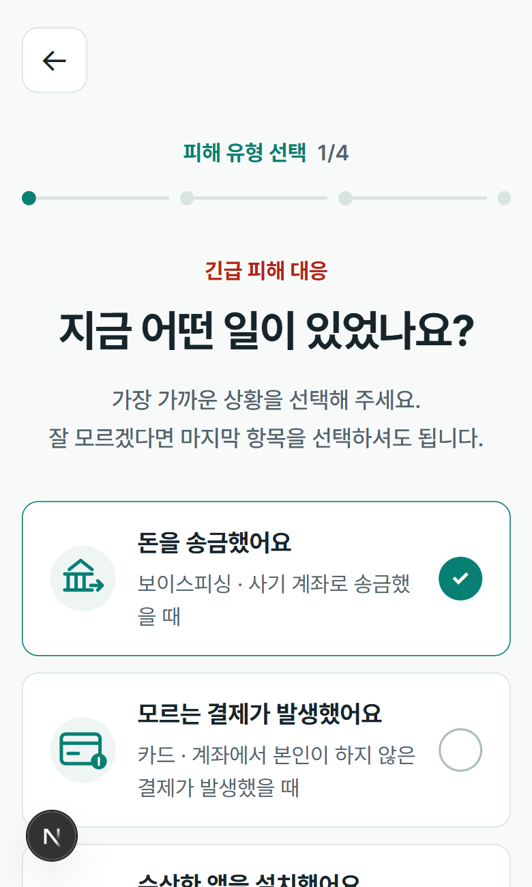

# 금융도우미

50~70대 금융소비자가 금융 피해 상황을 단계적으로 정리하고,
검토된 공식 근거를 바탕으로 지금 해야 할 행동을 확인할 수 있도록 만든 금융소비자 보호 서비스입니다.

한 화면에서 하나의 판단에 집중하는 키오스크형 UX를 사용하고,
금융 행동은 Backend가 결정하며 AI는 확인된 내용과 근거를 이해하기 쉬운 표현으로 설명합니다.

## Screens

<p align="center">
  
  
</p>

<p align="center">
  
  
</p>

### Emergency

<p align="center">
  
  
</p>

## 상담 흐름

```text
문제 선택
→ 상황 입력
→ Backend-driven 추가 질문
→ 입력 내용 확인
→ Grounded Analysis
→ 저장된 결과
```

추가 질문은 고정된 질문 목록을 순서대로 보여주지 않습니다.

Backend가 현재까지 확인된 사실과 승인된 Procedure를 기준으로
다음 판단에 필요한 사실 하나를 선택하고,
이미 확인한 내용은 다시 묻지 않습니다.

`잘 모르겠어요`도 정상적인 답변으로 처리하며
AI가 모르는 값을 임의로 채우지 않습니다.

## UX

50~70대 사용자를 주요 Persona로 두고 다음 원칙을 적용했습니다.

- 한 화면에서 하나의 판단에 집중
- 48px 이상의 터치 영역
- 큰 질문과 명확한 Primary Action
- 어려운 내부·금융 용어 최소화
- 색상만으로 선택이나 위험 상태를 표현하지 않음
- 390×844 모바일 화면을 기준으로 QA

상담 단계와 완료 여부는 Frontend가 추론하지 않고
Backend의 `currentStep`과 Server State를 기준으로 처리합니다.

## State

```text
Server State  → TanStack Query
Form State    → React Hook Form + Zod
Local UI      → useState
Flow          → Backend currentStep
```

상담 원문과 저장된 상담 상태를 Local Storage에 복제하지 않습니다.

## Emergency

긴급 금융 피해 대응은 로그인 없이 사용할 수 있습니다.

OpenAI나 Retrieval 결과를 실시간으로 생성하지 않고,
Backend에서 검토한 `EmergencyScenario`만 사용해
즉시 행동, 금지 행동, 공식 연락처와 증거 보존 항목을 안내합니다.

## Tech Stack

`Next.js` `TypeScript` `React`  
`TanStack Query` `React Hook Form` `Zod`  
`Tailwind CSS`

## Run

```bash
npm ci
npm run dev
```

`.env.local`

```env
NEXT_PUBLIC_API_BASE_URL=http://localhost:8080/api/v1
```

Frontend에는 공개 가능한 API origin만 설정합니다.
OpenAI, DB, OAuth, Korean Law API 등의 secret은 `NEXT_PUBLIC_*`에 두지 않습니다.

## Links

- [Backend Repository](https://github.com/Economy0326/financial-helper-backend)
- [Project Documentation](https://cute-quit-4fd.notion.site/3bd25931ce3580ae8ad8f0fa3acdf41a)