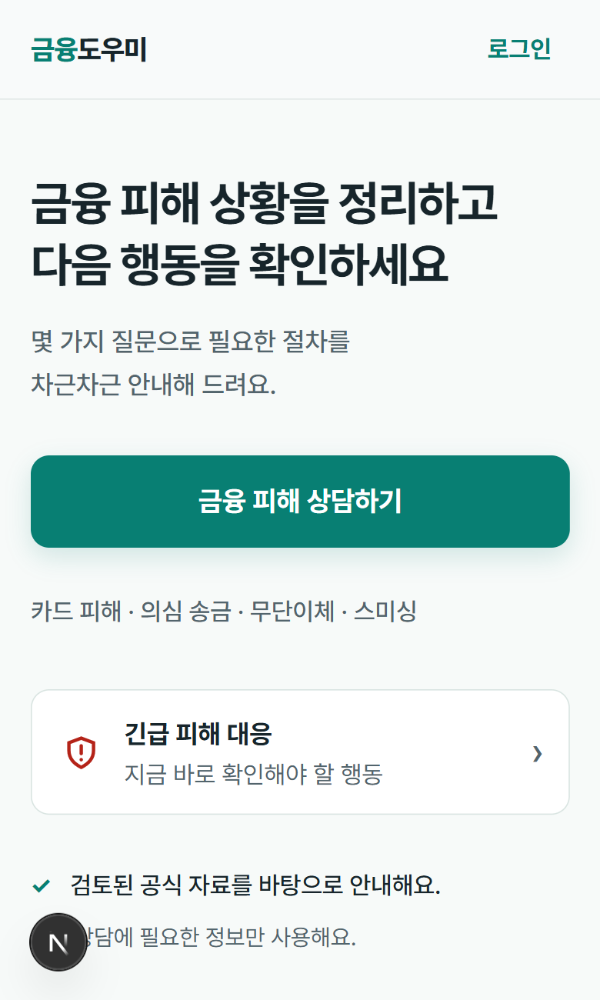
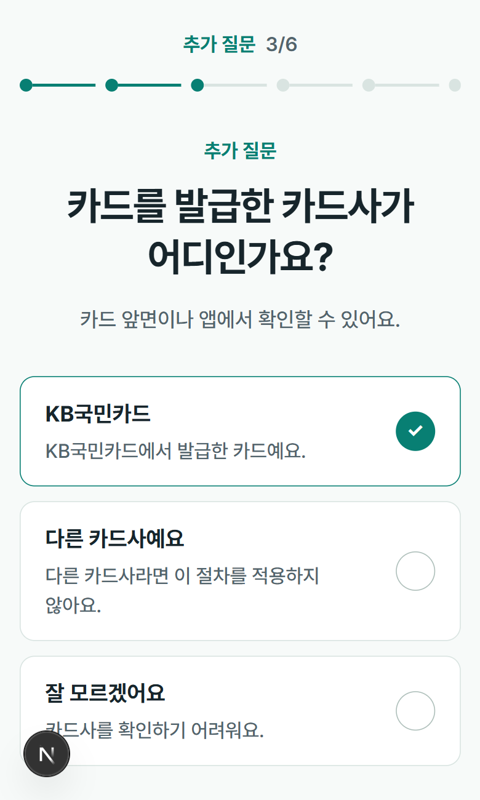
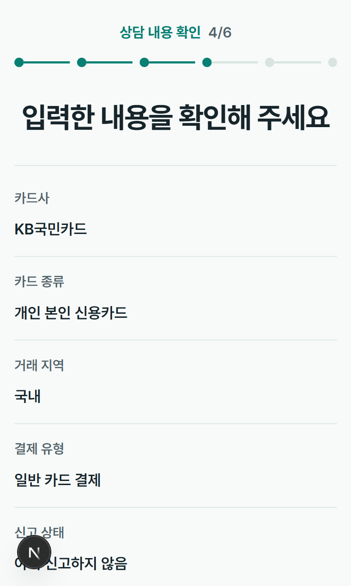
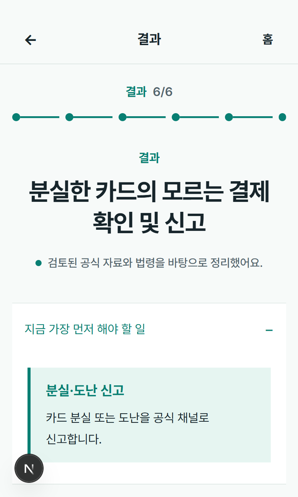
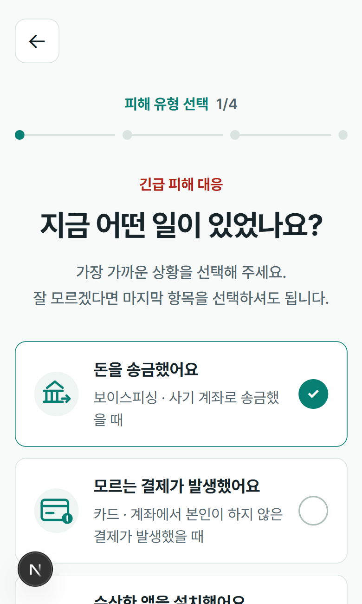
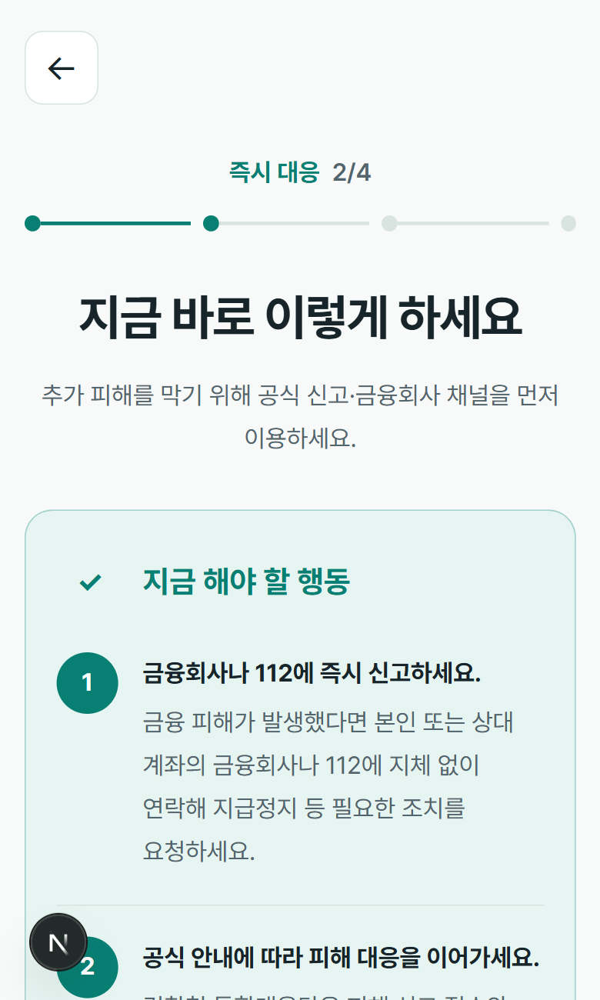

# 금융도우미

50~70대 금융소비자가 금융 피해 상황을 단계적으로 정리하고,
검토된 공식 근거를 바탕으로 지금 해야 할 행동을 확인할 수 있도록 만든 금융소비자 보호 서비스입니다.

한 화면에서 하나의 판단에 집중하는 키오스크형 UX를 사용하고,
금융 행동은 Backend가 결정하며 AI는 확인된 내용과 근거를 이해하기 쉬운 표현으로 설명합니다.

## Screens

<p align="center">
  
  
</p>

<p align="center">
  
  
</p>

### Emergency

<p align="center">
  
  
</p>

## 상담 흐름

```text
문제 선택
→ 상황 입력
→ Backend-driven 추가 질문
→ 입력 내용 확인
→ Grounded Analysis
→ 저장된 결과
```

추가 질문은 고정된 질문 목록을 순서대로 보여주지 않습니다.

Backend가 현재까지 확인된 사실과 승인된 Procedure를 기준으로
다음 판단에 필요한 사실 하나를 선택하고,
이미 확인한 내용은 다시 묻지 않습니다.

지원 상담 유형은 다음 4개 Scenario를 기준으로 구성합니다.

- 카드 분실·본인 아닌 결제
- 보이스피싱·의심 송금
- 본인 아닌 계좌이체
- 스미싱·악성앱·개인정보 노출

사용자가 선택한 유형과 Situation이 다른 지원 Scenario에 더 가까운 경우
Backend의 `suggestedScenario`를 보여주고
사용자가 직접 확인한 경우에만 상담 유형을 변경합니다.

Frontend에서 자동으로 Scenario를 전환하지 않습니다.

`잘 모르겠어요`도 정상적인 답변으로 처리하며
AI가 모르는 값을 임의로 채우지 않습니다.

같은 핵심 정보를 한 번 더 확인한 뒤에도 알 수 없고
Backend가 `insufficient_information`을 반환하면
현재 질문과 선택지를 유지한 채 필요한 정보를 다시 확인할 수 있도록 안내합니다.

`답변 다시 확인하기`는 로컬 UI만 전환하며,
사용자가 실제 답변을 새로 제출할 때만 Follow-up API를 호출합니다.

## UX

50~70대 사용자를 주요 Persona로 두고 다음 원칙을 적용했습니다.

- 한 화면에서 하나의 판단에 집중
- 48px 이상의 터치 영역
- 큰 질문과 명확한 Primary Action
- 어려운 내부·금융 용어 최소화
- 색상만으로 선택이나 위험 상태를 표현하지 않음
- 390×844 모바일 화면을 기준으로 QA

상담 단계와 완료 여부는 Frontend가 추론하지 않고
Backend의 `currentStep`과 Server State를 기준으로 처리합니다.

Situation 입력 예시는 선택한 Scenario에 맞게 변경되며,
지원 기관이나 금융 정책을 Frontend placeholder에 hardcode하지 않습니다.

Summary에서는 Backend가 제공하는 structured fact의
`label`과 `displayValue`를 그대로 사용합니다.

Frontend가 자연어 Summary를 다시 parsing하거나
fact key를 금융 의미로 임의 해석하지 않습니다.

## State

```text
Server State  → TanStack Query
Form State    → React Hook Form + Zod
Local UI      → useState
Flow          → Backend currentStep
```

상담 원문과 저장된 상담 상태를 Local Storage에 복제하지 않습니다.

공식 근거 확인 실패 역시 Frontend에서 원인을 추측하지 않고
Backend의 `evidenceFailureReason`을 기준으로 표시합니다.

- `REVIEW_REQUIRED` — 검토되지 않은 공식 근거 version
- `TEMPORARY_UNAVAILABLE` — 일시적인 공식 근거 조회 문제
- `COVERAGE_GAP` — 현재 검토된 근거 범위에서 결과 생성이 어려운 상태

lawId, MST, stack trace 같은 내부 정보는 사용자 화면에 노출하지 않습니다.

## Emergency

긴급 금융 피해 대응은 로그인 없이 사용할 수 있습니다.

OpenAI나 Retrieval 결과를 실시간으로 생성하지 않고,
Backend에서 검토한 `EmergencyScenario`만 사용해
즉시 행동, 금지 행동, 공식 연락처와 증거 보존 항목을 안내합니다.

## Tech Stack

`Next.js` `TypeScript` `React`  
`TanStack Query` `React Hook Form` `Zod`  
`Tailwind CSS`

## Run

```bash
npm ci
npm run dev
```

`.env.local`

```env
NEXT_PUBLIC_API_BASE_URL=http://localhost:8080/api/v1
```

Frontend에는 공개 가능한 API origin만 설정합니다.
OpenAI, DB, OAuth, Korean Law API 등의 secret은 `NEXT_PUBLIC_*`에 두지 않습니다.

## Verification

```bash
npm run lint
npm run build
```

최종 Browser QA에서는 다음 주요 흐름을 확인했습니다.

- CARD supported happy path
- Scenario mismatch confirm
- explicit unsupported recovery
- fatal `UNKNOWN` / `답변 다시 확인하기` recovery
- Voice phishing Analysis → Report
- Unauthorized account transfer 기본 flow
- Smishing Summary / Report
- Scenario별 Situation placeholder
- Report headline / official evidence layout

`npm run lint`, `npm run build`, TypeScript 검사와 production build를 최종 통과했습니다.

## Links

- [Backend Repository](https://github.com/Economy0326/financial-helper-backend)
- [Project Documentation](https://cute-quit-4fd.notion.site/3bd25931ce3580ae8ad8f0fa3acdf41a)